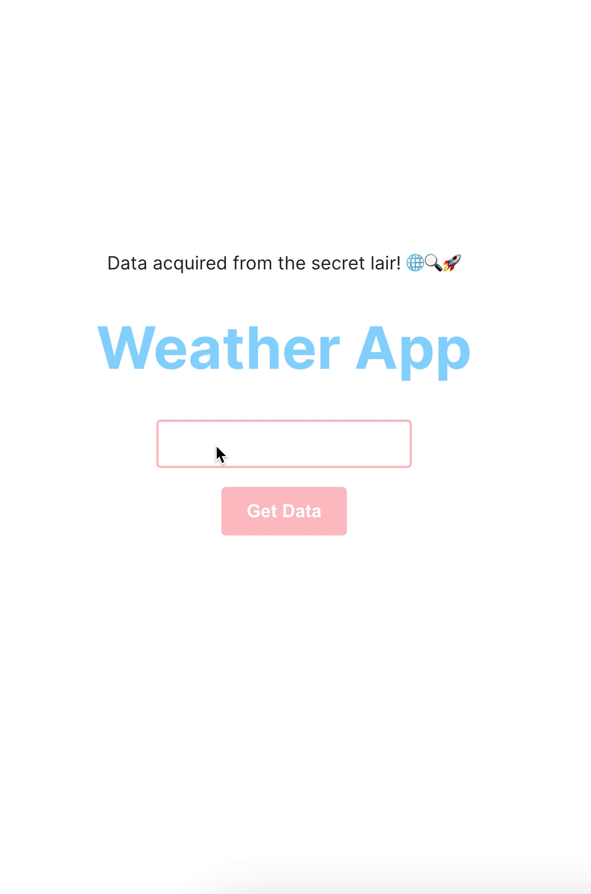

## Weather App

### Technologies Used:

##### Backend:
Node.js
Express.js
CORS 
dotenv 

##### Frontend:
React
Vite 
CSS 

##### External Services/APIs:
OpenWeatherMap API

##### Instructions: 
https://github.com/Techtonica/curriculum/blob/main/projects/weather-app.md

